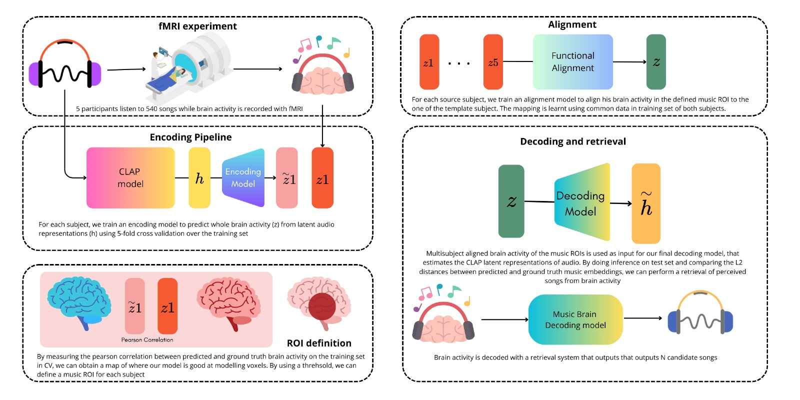

# R&B - Rhythm and Brain: Cross-subject Decoding of Music from Human Brain Activity

Abstract from the arxiv [paper](https://arxiv.org/abs/2406.15537#:~:text=21%20Jun%202024%5D-,R%26B%20%2D%2D%20Rhythm%20and%20Brain%3A%20Cross%2Dsubject%20Decoding%20of,Music%20from%20Human%20Brain%20Activity&text=Music%20is%20a%20universal%20phenomenon,(fMRI)%20during%20its%20perception.): Music is a universal phenomenon that profoundly influences human experiences across cultures. This study investigates whether music can be decoded from human brain activity measured with functional MRI (fMRI) during its perception. Leveraging recent advancements in extensive datasets and pre-trained computational models, we construct mappings between neural data and latent representations of musical stimuli. Our approach integrates functional and anatomical alignment techniques to facilitate cross-subject decoding, addressing the challenges posed by the low temporal resolution and signal-to-noise ratio (SNR) in fMRI data. Starting from the GTZan fMRI dataset, where five participants listened to 540 musical stimuli from 10 different genres while their brain activity was recorded, we used the CLAP (Contrastive Language-Audio Pretraining) model to extract latent representations of the musical stimuli and developed voxel-wise encoding models to identify brain regions responsive to these stimuli. By applying a threshold to the association between predicted and actual brain activity, we identified specific regions of interest (ROIs) which can be interpreted as key players in music processing. Our decoding pipeline, primarily retrieval-based, employs a linear map to project brain activity to the corresponding CLAP features. This enables us to predict and retrieve the musical stimuli most similar to those that originated the fMRI data. Our results demonstrate state-of-the-art identification accuracy, with our methods significantly outperforming existing approaches. Our findings suggest that neural-based music retrieval systems could enable personalized recommendations and therapeutic applications. Future work could use higher temporal resolution neuroimaging and generative models to improve decoding accuracy and explore the neural underpinnings of music perception and emotion.

## Approach

The "multisubject_align.ipynb" sheet code contains all the project pipeline, resumed in the following figure:

In particular, we describe the main steps:

- Loading and preprocessing the fMRI and audio data, calling the "load_data" function from the "data_agg.py" code. For each subject, fMRI data is loaded, masked using [Nilearn](https://nilearn.github.io/dev/index.html), and saved in a structured format. A matrix is constructed based on stimulus onsets, aligning fMRI data with specific genre-related events, ensuring temporal correspondence. The fMRI data undergoes standardization and detrending. Corresponding audio data is loaded for each event and passed through a pre-trained ClapModel (laion/larger_clap_music_and_speech) for feature extraction. Resampling is applied to align audio sample rates before feature extraction. The data is separated into training and test sets for both fMRI and audio features, along with genre labels.

- Using a base masker from one subject, the code undoes and reapplies the masking process for both training and testing fMRI data. This step ensures that all fMRI data is transformed to the same number of voxels for consistency.

- A specific mask (from the "mask_01.nii.gz" file computed in the "CLAP.ipynb" sheet code) is loaded, and fMRI data is reduced to selected voxels as defined by this mask. The masked fMRI data is then averaged across time points for each subject. The mask come out from the encoding model using Ridge regression and selecting voxels based on correlation scores. The "CLAP.ipynb" code imports the RidgeCV regression model from the [Himalaya](https://gallantlab.org/himalaya/) package. The scores are transformed back into brain space using [Nilearn](https://nilearn.github.io/dev/index.html), and threshold is applied to the smoothed R2 image. 

- The function "process_data" organizes the data into structured formats, where fMRI data, audio features, and genre labels are grouped and averaged by stimulus (music events). This averaging helps in creating consistent input-output pairs for further modeling.

- Functional Alignment to align the brain activity (fMRI data) of different subjects to a common reference subject, sub-001. A loop iterates through all the subjects, aligning their fMRI data to the target one. A RidgeCV model is initialized with a range of alphas (regularization parameters) and is used to align the source subject’s brain activity to the target subject.

- A Ridge regression model is initialized with an alpha value of 20, and it is trained to map the aligned fMRI data to the audio features in the decoding approach. After training, the model is used to predict audio features from the test fMRI data. 

- The k-nearest neighbors algorithm (NearestNeighbors) is applied to the audio features to identify the closest matches between the predicted audio features and the test set audio features. The function "calculate_retr_accuracy" computes the accuracy of genre retrieval by checking if the predicted genre matches the true genre. The accuracy is calculated for both Top-1 (the most likely prediction) and Top-3 (the top 3 closest predictions).

